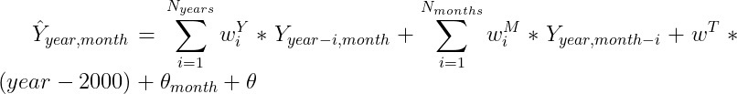
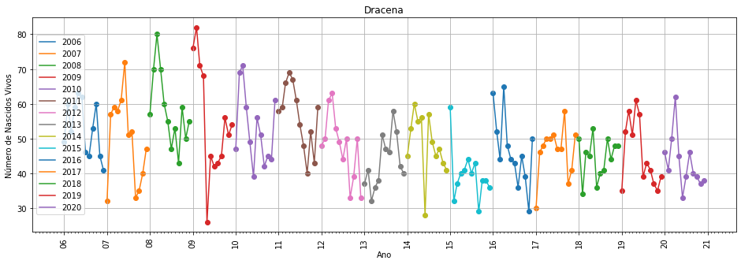
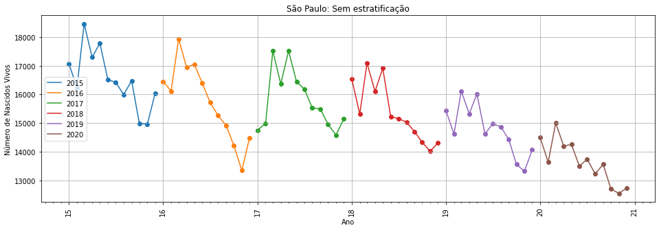
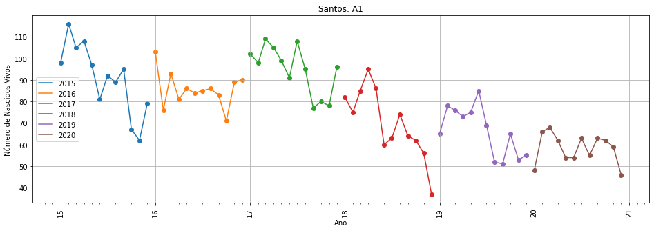

# Projeto `Impacto da pandemia da COVID-19 nos indicadores da saúde materna e perinatal nas mulheres em idade fértil do Estado de São Paulo.`

## Project `Impact of the COVID-19 pandemic on maternal and perinatal health indicators in women of childbearing age in the state of São Paulo.`

# Apresentação

O presente projeto foi originado no contexto das atividades da disciplina de pós-graduação [*Ciência e Visualização de Dados em Saúde*](https://github.com/datasci4health/home), oferecida no primeiro semestre de 2021, na Unicamp.


|Nome  | RA | Especialização|
|--|--|--|
|Charles M'poca Charles | 163383 | Saúde|
| Silvia Arantes Pereira Olivio | 224932  | Computação|
| Débora Rocha Helfstein  | 234934  | Farmacêutica|
| Paulo Augusto Alves Luz Viana | 263889 | Elétrica |

Você pode rodar o notebook com todas as análises atráves deste [Jupyter notebook no Google Colab!](https://colab.research.google.com/github/Kotzly/DS4H_Course/blob/v1.1/notebooks/DS4H_full.ipynb).

## Descrição Resumida do Projeto
Introdução: A pandemia da COVID-19 causada pelo vírus SARS_COV_2 tem tomado proporções alarmantes ao nível mundial. Atualmente (12/04/2021), ao nível global foram notificados cerca de 136,181,468, sendo o Brasil um dos países mais afetado pela pandemia, com aproximadamente 2,938,804 caso notificados. A pandemia tem afetado a população no geral sem distinção do sexo, raça, e estrato social com grande impacto no sistema de saúde. De entre os efeitos da pandemia no sistema de saúde, destacam-se a interrupção ou redução de provisão dos serviços de saúde materna e perinatal que podem influenciar negativamente nos seus indicadores, como é o caso do número de nascidos vivos. Objetivo: o presente estudo tem o objetivo de avaliar o impacto da pandemia da COVID-19 no número de nascidos vivos nos municípios do estado de São Paulo. Metodologia: será realizado uma análise de serie temporal, baseada em dados Sistema de Informações de Nascidos Vivos (SINASC/DATASUS) e do Banco de Dados de Síndrome Respiratória Aguda Grave (SRAG 2021), com o auxílio de métodos estatísticos  e de ferramentas inteligência artificial (métodos de aprendizado de maquinas) - SPSS Modeler 18.1, Google Colab e  Jupyter Notebook - realizaremos a modelagem, análise da curva de nascimentos vivos nos últimos 10 anos prévios a pandemia e a predição do número de nascidos vivos esperados para o ano 2020.  Resultados esperados: através desta pesquisa esperamos obter os padrões das curvas de nascidos vivos e estabelecer uma correlação entre a pandemia e o indicador de saúde materna e perinatal para os diferentes municípios do estado de São Paulo.

Por favor, assista ao [vídeo](https://drive.google.com/file/d/1xz9lfkAAQFm5fQf4hEIceaY8FeVvwFCI/view?usp=sharing) de apresentação do projeto.

## Estrutura de arquivos e pastas

```text
DS4H_Course
├───assets                              <- Arquivos relacionados ao projeto.
│   └───excel                           <- Arquivos excel gerados durante o desenvolvimento.
├───data                                <- Dados utilizados no projeto.
│   ├───external
│   └───processed
│       └───indexes
├───documents                           <- Documentos relacionados ao projeto e aos dados.
├───notebooks                           <- Notebooks jupyter utilizados no projeto.
└───src                                 <- Código fonte do projeto.
    ├───ds4h                            <- Pacote python instalável.
    │   ├───data
    │   ├───orange
    │   ├───processing
    │   ├───scripts
    │   └───visualization
    └───orange                          <- Arquivos do Orange usados para visualização.
```
# Instalação

O projeto está sendo desenvolvido majoritariamente em Python 3.6, mas também foram utilizadas outras ferramentas como R, Orange, e Prism. É possível instalar o pacote do projeto (`ds4h`) seguindo os seguintes passos:
 - Instale o [Anaconda](https://www.anaconda.com/products/individual). Ele será usada para o gerenciamento do ambiente python.
 - Para rodar os scripts do Orange, instale-o na tela inicial do Anaconda. Para fazer isso, abra o Anaconda Navigator no seu computador, e clique em `install` no ícono do Orange.
 - Na linha de comando ou no Anaconda shell, crie o ambiente com:

```
conda env create -n ds4h python=3.6
conda activate ds4h
```

 - Na pasta raiz do projeto, instale o pacote com:

```
pip install ./src
```

 - Caso você vá rodar o notebook principal do projeto, instale a linguagem R em sua máquina. A maneira mais fácil de fazer isso é instalando o [RStudio](https://www.rstudio.com/products/rstudio/download/#download), mas não problema em instalar apenas o R.

## Como usar

É possível executar todas os passos de download, pré-processamento, processamento e análise de dados (feitos até a segunda entrega) [neste notebook](https://colab.research.google.com/github/Kotzly/DS4H_Course/blob/v1.1/notebooks/DS4H_full.ipynb) no Google Colab. Considera-se a entrega principal como sendo este notebook, que contém os racional das análises, além do código Python.

Para executar o notebook em sua própria máquina, primeiro siga todos os passos descritos em **Instalação**. Após isto, abra a linha de comando ou o Anaconda shell na pasta raiz do projeto e rode:

```
conda activate ds4h
jupyter notebook
```

Vá até a pasta `notebooks` e abra o notebook **DS4H_full.ipynb**.


# Projeto `Impacto da pandemia da COVID-19 nos indicadores da saúde materna e perinatal nas mulheres em idade fértil do Estado de São Paulo.`

## Project `Impact of the COVID-19 pandemic on maternal and perinatal health indicators in women of childbearing age in the state of São Paulo.`

# Apresentação

O presente projeto foi originado no contexto das atividades da disciplina de pós-graduação [*Ciência e Visualização de Dados em Saúde*](https://github.com/datasci4health/home), oferecida no primeiro semestre de 2021, na Unicamp.


|Nome  | RA | Especialização|
|--|--|--|
|Charles M'poca Charles | 163383 | Saúde|
| Silvia Arantes Pereira Olivio | 224932  | Computação|
| Débora Rocha Helfstein  | 234934  | Farmacêutica|
| Paulo Augusto Alves Luz Viana | 263889 | Elétrica |

Você pode rodar o notebook com todas as análises atráves deste [Jupyter notebook no Google Colab!](https://colab.research.google.com/github/Kotzly/DS4H_Course/blob/v1.0/notebooks/DS4H_full.ipynb).

## Descrição Resumida do Projeto
Introdução: A pandemia da COVID-19 causada pelo vírus SARS_COV_2 tem tomado proporções alarmantes ao nível mundial. Atualmente (12/04/2021), ao nível global foram notificados cerca de 136,181,468, sendo o Brasil um dos países mais afetado pela pandemia, com aproximadamente 2,938,804 caso notificados. A pandemia tem afetado a população no geral sem distinção do sexo, raça, e estrato social com grande impacto no sistema de saúde. De entre os efeitos da pandemia no sistema de saúde, destacam-se a interrupção ou redução de provisão dos serviços de saúde materna e perinatal que podem influenciar negativamente nos seus indicadores, como é o caso do número de nascidos vivos. Objetivo: o presente estudo tem o objetivo de avaliar o impacto da pandemia da COVID-19 no número de nascidos vivos nos municípios do estado de São Paulo. Metodologia: será realizado uma análise de serie temporal, baseada em dados Sistema de Informações de Nascidos Vivos (SINASC/DATASUS) e do Banco de Dados de Síndrome Respiratória Aguda Grave (SRAG 2021), com o auxílio de métodos estatísticos  e de ferramentas inteligência artificial (métodos de aprendizado de maquinas) - Google Colab e  Jupyter Notebook - realizaremos a modelagem, análise da curva de nascimentos vivos nos últimos 10 anos prévios a pandemia e a predição do número de nascidos vivos esperados para o ano 2020.  Resultados esperados: através desta pesquisa esperamos obter os padrões das curvas de nascidos vivos e estabelecer uma correlação entre a pandemia e o indicador de saúde materna e perinatal para os diferentes municípios do estado de São Paulo.

## Abstract??? Charles

# Videos do Projeto  - Débora

## Vídeo da Proposta
Por favor, assista ao [vídeo](https://drive.google.com/file/d/1xz9lfkAAQFm5fQf4hEIceaY8FeVvwFCI/view?usp=sharing) de apresentação do projeto.

## Vídeo da Apresentação Final  - Falta


# Slides do Projeto - Falta Débora

## Slides da Proposta - https://github.com/Kotzly/DS4H_Course/blob/main/Slides%20do%20Projeto
## Slides da Apresentação Final - Falta

# Introdução e Referenciais de Teóricos - Charles
> Contextualização do projeto 
>
> Caracterização do problema
>
> Motivação
>
> Relevância
>
> Trabalhos relacionados
>
> Indicação (bastante resumida) da análise proposta
>
> Indicação (bastante resumida) dos resultados alcançados

## Perguntas de Pesquisa
 - Qual foi o impacto da pandemia da COVID-19 na taxa de nascidos vivos no Estado de São Paulo?
 - É possível prever a taxa de nascidos vivos dos anos seguintes com os dados anteriores?

# Objetivos do Projeto - Charles
> Como seu projeto propôs abordar o problema apresentado.

# Metodologia
## Análise estatística
Durante a análise dos dados, decidimos realizar um teste de hipóteses sobre os dados. A hipótese nula defende a ideia de que não existe diferença entre os anos sem e com pandemia.
A primeira dificuldade que encontramos foi a de achar um teste para um conjunto de dados pequeno e que pudesse ser usado por uma distribuição não normal. 
Após inúmeras pesquisas, descobrimos que os testes não paramétricos não supõem uma distribuição específica para a população, esses testes podem ser especialmente úteis quando você tem uma amostra pequena e destruição não normal, que se identificava com a nossa amostra.
Porém a exemplo dos testes que encontramos como o teste H de Kruskal-Wallis é uma versão não paramétrica da ANOVA, era necessário ter variáveis quantitativas, e o nosso modelo tem uma variável de resposta quantitativa e variáveis explicativa categórica.
Diante dessa segunda dificuldade optamos por utilizar o Teste one way anova, e apesar do modelo não ter uma distribuição normal, foi o teste que mais deu significância.
No notebook, mantemos os testes realizados, Shapiro-Wilk statistic, Kolmogorov-Smirnov test statistic, e One-way ANOVA.
A tabela abaixo resume o p-value anova para as cidades do ranking levando em consideração as estratificações abaixo.
   - Divisão étnica/racial:
    - Apenas brancos;
    - Apenas não-brancos.
 - Divisão por escolaridade:
    - Até 7 anos de estudos;
    - 8 ou mais anos de estudos.
 - Divisão por estado civil:
    - Casada ou união estável;
    - Solteira.
 - Por idade:
    - Menos de 20 anos (A1);
    - De 20 anos à 35 anos (A2);
    - Mais de 35 anos (A3);


## Modelagem
Para a modelagem, utilizou-se um modelo linear baseado em recorrências. Uma amostra é o número de nascidos vivos em um mês de um determinado ano. O modelo é:
    

    \hat{Y}_{year, month} = \sum _{i=1}^{N_{years}}  w^Y_i * Y_{year-i, month} + \sum _{i=1}^{N_{months}}  w^M_i * Y_{year, month-i} + w^T*(year - 2000) + \theta_{month} + \theta 

Onde w^Y_i e w^M_i são os parametros da recorrência dos anos anterioes e dos meses anterioes, respectivamente, w^Y é o parâmetro de tendência, \theta_{month} é um parâmetro relativo ao mês *month*, e \theta é o *intercept* do modelo.

Para que a equação acima faça sentido, temos as equivalências:
 - Y_{2020, -1} = Y{2019, 11}
 - Y_{2020, -2} = Y{2019, 10}
 - ...

Este modelo foi utilizado por utilizar duas recorrências interessantes, no mês e no ano. A recorrência nos valores do número de nascidos vivos dos meses anteriores faz com que o modelo capture características recentes do comportamento da série temporal, enquanto que a recorrência no número dos anos anteriores, para o mesmo mês, faz com que o modelo capture o comportamento daquele  mês especifico, para os anos anteriores (já que foi notado certa sazonalidade no número de nascidos vivos nos meses do ano). O parâmetro \theta_{month} também controlará o valor predito para cada mês especifico. O parâmetro *w^T* controla a tendência do número de nascidos vivos (e.g., se há uma tendência de decrescimento do número de nascidos vivos, todo mês, espera-se que *w^T* seja negativo). Por fim, \theta é o equivalente ao *intercept* desta modelagem.


Serão utilizados dois conjuntos treino:
    - O primeiro utilizará todos os anos e meses que temos dados, menos os anos do zika-vírus (2016/2017) e do corona vírus (segundo semestre de 2020) para o treino. O objetivo aqui é verificar como o modelo se sai sem a informação de um ano "anômalo", onde conhecidamente houve decréscimo no número de nascidos vivos devido à uma pandemia. Este será o chamado 'Fold 0';
    - O segundo conjunto utilizará todos os anos, menos o segundo semestre de 2020. Este será o chamado 'Fold 1';

Em ambos os casos, o conjunto de teste será o segundo semestre de 2020. Utilizaremos apenas o segundo semestre pois espera-se que haja um intervalo de pelo menos 8 meses desde o advento (começo do corona vírus) até vermos o impacto no número de nascidos vivos, devido ao número de meses que leva da concepção até o parto.

Será criado um modelo para cada cidade, pois foi visto na análise exploratória que cada cidade tem comportamentos diferentes de tendência entre os anos e de sazonalidade entre os meses. A análise de resultados será feita utilizando-se a hipótese de que se houve um bom ajuste de parâmetros no treino, este modelo representa bem os dados de treinos, e caso o modelo performe mal no teste, há a possibilidade de que os dados de teste realmente estão diferentes dos dados de treino, portanto houve certa diferença no número de nascidos vivos do teste.

Será criado um modelo, com a mesma estrutura apresentada, para cada cidade. Também serão realizados experimentos onde se selecionará apenas o número de nascidos vivos para certa parcela da população:
 - Divisão étnica/racial:
    - Apenas brancos;
    - Apenas não-brancos.
 - Divisão por escolaridade:
    - Até 7 anos de estudos;
    - 8 ou mais anos de estudos.
 - Divisão por estado civil:
    - Casada ou união estável;
    - Solteira.
 - Por idade:
    - Menos de 20 anos (A1);
    - De 20 anos à 35 anos (A2);
    - Mais de 35 anos (A3);

Esta divisão é realizada para se verificar se a diferença ou não-diferença entre o número de nascidos vivos durante a pandemia de COVID-19 tem diferença ao se separar estas variáveis.

### Comentário

A estrutura do modelo utilizado foi encontrada empiricamente. Discutimos que realment seria interessante termos uma recorrência nos meses anteriores ao mês de predição, mas dificilmente este modelo era satisfatoriamente ajustado no treino (as métricas ficavam ruins). Ao se relembrar como a maioria das cidades apresenta certa sazonalidade no número de nascidos vivos, ou seja, a curva de todos os anos apresenta um "formato" parecido, pareceu-se interessante utilizar também componentes da recorrência com valores do mesmo mês, mas para anos anteriores.

Esta modelagem melhorou os resultados, isto é, mais modelos tiverem resultados satisfatórios no treino e alguns começaram a generalizar para o teste. Após isto, verificou-se que certas cidade tem crescimentos ou decrescimentos dos números mensais e anuais de nascidos vivos constante, então se adicionou um parâmetro ao próprio valor do ano. O esperado é que, se, por exemplo, todo ano em média o número de nascidos vivos de uma cidade cair em 100, o parâmetro que multiplica o ano (wT) no modelo seja -100/12, ou algo próximo a isso. Também adicionou-se um parâmetro fixo por mês, que esperava-se que capture-se também o comportamente sazonal do número de nascidos vivos. 

Com isto houve um número razoável de cidades que estavam sendo bem ajustadas ao treino, e que ainda conseguiam generalizar no teste. Para evitar um viés de escolha (remodelar o problema até termos bons resultados de teste), o ideal seria termos um conjunto de validação, onde validaríamos os nossos modelos, para no final termos o resultado no teste, mas como nosso objetivo de previsão era exatamente os 6 meses de pandemia e como temos 1 amostra por mês, seria impraticável diminuir ainda mais o conjunto de teste para separá-lo em validação (separar um pedaço do treino em validação seria inútil, já que o objetivo do modelo é predizer o número de NV durante a pandemia). Como isso não foi feito, tomou-se o cuidado de se passar por poucas rodadas de melhora do modelo, mas ainda é altamente provável que haja um viés ou estocasticidade de performance do modelo (o modelo funciona bem para uma cidade por "sorte", e não porque representa bem a realidade).

Entretanto, considera-se a análise feita completamente válida, já que o modelo utilizado é relativamente simples, o que daria menos chance de ocorrer o overfitting do modelo, mas também não é tão simples (dado o número de amostras), o que também diminui a chance dele ir bem no teste por "sorte". Na seção de Discussão mostraremos como a análise feita se traduz para os valores reais utilizando também um pouco de visualização dos números por mês.

## Bases de Dados

 - [Sistema de Informação de Nascidos Vivos](https://datasus.saude.gov.br/transferencia-de-arquivos/) (SINASC/DATASUS), website do ministério da saúde

 - [Banco de Dados de Síndrome Respiratória Aguda Grave](https://opendatasus.saude.gov.br/dataset/bd-srag-2021) - incluindo dados da COVID-19
 
 - SP Contra o Novo Coronavírus (Seade/coronavírus) (https://www.saopaulo.sp.gov.br/coronavirus/)
 -
 - Biblioteca Virtual – São Paulo: população do municípios paulistas (http://www.bibliotecavirtual.sp.gov.br/temas/sao-paulo/sao-paulo-populacao-dos-municipios-paulistas.php)


## Variáveis de interesse  

 - Tamanho da população do estado de São Paulo e dos municípios;
 - Número de casos de COVID-19 no estado e por município de São Paulo;
 - Número de Óbitos no estado e por Município.
 - Dados da mãe:
 - Idade da mãe;
 - Escolaridade;
 - Status marital;
 - Cor de pele/raça;
 - Tipo de parto;
 - Se nasceu com anomalia;
 - Número de filhos vivos;
 - Número de filhos mortos.

### Integração entre Bases e Análise Exploratória ??? Silvia

# Análises Realizadas - Silvia - Dados faltantes, Estatística, dos gráficos. Paulo Modelos, analises estatística. 
> Descrição detalhada das análises realizadas.

## Ferramentas

### Ferramentas de software
Ferramenta | Endereço na Web | Resumo descritivo e uso
----- | ----- | -----
Python | https://www.python.org/ | Python é uma linguagem de programação de alto nível, interpretada de script, imperativa, orientada a objetos, funcional, de tipagem dinâmica e forte. Utilizaremos extensivamento bibliotecas como [Pandas](https://pandas.pydata.org/), [Numpy](https://numpy.org/), [Matplotlib](https://matplotlib.org/), [SciPy](https://www.scipy.org/) e [Scikit-learn](https://scikit-learn.org/stable/).
Jupyter Notebook | https://jupyter.org/ | Documento virtual que permite execução de rotinas usuais de programação e documentação de todo o processo de produção do código. No projeto será utilizado para o código de reestruturação da base de dados e para os modelos.
Google Colab | https://colab.research.google.com/ | Similar ao jupyter notebook, o Colab é uma lista de células que podem conter textos explicativos ou códigos executáveis e suas respectivas saídas.
R | https://www.rstudio.com/products/rstudio/download/#download | R é uma linguagem de programação multi-paradigma orientada a objetos, programação funcional, dinâmica, fracamente tipada, voltada à manipulação, análise e visualização de dados. No projeto se utilizou o RStudio como meio de instalação do R.

### Ferramentas estatísticas
O ferramental estatístico utilizado será o apresentado durante as aulas, mais os que os componentes do grupo tiverem conhecimento e julgarem adequados. Como já foi descrito, iremos utilizar:
 - Regressão linear (no número de nascidos vivos).
 - Testes de hipótese (comparação entre os número de nascidos vivos, entre as proporções de nascidos vivos entre subamostras da população, testes de normalidade).
 - Aprendizado de máquina (técnicas de validação de modelos estatísticos, métricas, métodos explicáveis e métodos de [XAI](https://en.wikipedia.org/wiki/Explainable_artificial_intelligence)).

# Resultados

## Modelos

Na análise dos modelos criados se utilizou duas métricas avaliação, o R² e o MAPE (*Mean absolute percentage error*). A escolha do MAPE foi feita para se poder comparar diferentes cidades na mesma escala, o que não poderia ser feito com o MSE ou o MAE, por exemplo.

Nas discussões sobre os resultados, nos referimos à um resultado como "bom" quando ele apresenta ou mais que 50% de R², ou menos de 10% de MAPE, ou ambos, e são considerados "ruins" caso contrário. Esses valores foram escolhidos por dividir de maneira satisfatória os resultados obtidos.

### Sem estratificação

Aqui não houve filtragem do dataset por nenhuma variável demográfica. Esta modelagem é interessante para verificar como o modelo se comporta para a população como um todo.
Pode-se ver que as cidades de Santos e São Paulo tiverem as melhores métricas de R2 no teste, e São José do Rio Preto e Araçatuba tiveram boas métricas de MAPE. Indicando que para estas 4 cidades o comportamento do segundo semestre de 2020 foi semelhante aos anos anteriores.
Também percebe-se que para Santa Isabel, Guaíra, Dracena e Andradina o modelo não se ajustou bem no treino, então não concluir que o comportamento de 2020 tenha sido diferente ou não, já que o modelo nem sequer se ajustou aos anos anteriores.
Para os demais anos, os resultados indicam que houve diferença no número de nascidos vivos. Para São Caetano do Sul, por exemplo, a diferença média do previsto para o valor real foi de 18.7%.

|    | Cidade    |   Fold 0, Train, R2 |   Fold 0, Train, MAPE |   Fold 0, Test, R2 |   Fold 0, Test, MAPE |   Fold 1, Train, R2 |   Fold 1, Train, MAPE |   Fold 1, Test, R2 |   Fold 1, Test, MAPE |
|---:|:----------------------|----------------------------:|------------------------------:|---------------------------:|-----------------------------:|----------------------------:|------------------------------:|---------------------------:|-----------------------------:|
|  0 | Andradina             |                      0.459  |                         0.109 |                     -0.414 |                        0.141 |                       0.445 |                         0.11  |                     -0.857 |                        0.164 |
|  1 | Araçatuba             |                       0.591 |                         0.057 |                      0.454 |                        0.035 |                       0.576 |                         0.06  |                      0.247 |                        0.045 |
|  2 | Barueri               |                       0.839 |                         0.047 |                      0.377 |                        0.084 |                       0.832 |                         0.047 |                      0.329 |                        0.086 |
|  3 | São Paulo             |                       0.915 |                         0.018 |                      0.613 |                        0.018 |                       0.898 |                         0.018 |                      0.529 |                        0.019 |
|  4 | Dracena               |                       0.404 |                         0.133 |                     -0.371 |                        0.074 |                       0.414 |                         0.138 |                     -0.796 |                        0.089 |
|  5 | Guaíra                |                       0.386 |                         0.147 |                     -0.73  |                        0.187 |                       0.397 |                         0.139 |                     -0.834 |                        0.185 |
|  6 | Jales                 |                       0.626 |                         0.082 |                      0.156 |                        0.064 |                       0.583 |                         0.086 |                     -0.083 |                        0.07  |
|  7 | Santa Isabel          |                       0.408 |                         0.112 |                     -0.382 |                        0.162 |                       0.389 |                         0.113 |                     -0.736 |                        0.181 |
|  8 | Santos                |                       0.849 |                         0.036 |                      0.802 |                        0.038 |                       0.837 |                         0.036 |                      0.783 |                        0.036 |
|  9 | São Caetano do Sul    |                       0.734 |                         0.093 |                      0.027 |                        0.175 |                       0.703 |                         0.093 |                     -0.117 |                        0.187 |
| 10 | São José do Rio Preto |                       0.898 |                         0.035 |                      0.236 |                        0.027 |                       0.89  |                         0.036 |                      0.134 |                        0.03  |
| 11 | Todas cidades         |                       0.915 |                         0.018 |                      0.816 |                        0.013 |                       0.899 |                         0.018 |                      0.785 |                        0.014 |

### RACACOR = White

No resultado apenas para as mães auto-declaradas brancas, o modelo não se ajustou bem nas cidades de Guaíra e Jales, segundo a métrica R2. Para a métrica MAPE, as cidades que se não ajustaram bem foram Andradina, Dracena, Guaíra e Santa Isabel. Do restante, apenas São Caetano do sul teve o MAPE > 10% no teste, podendo indicar que detectou-se mudança de comportamento do número de NV nesta cidade, e não houve mudança para as cidades demais (fora as cidades que não se ajustaram no treino, que tem resultados inconclusivos).

|    | Cidade    |   Fold 0, Train, R2 |   Fold 0, Train, MAPE |   Fold 0, Test, R2 |   Fold 0, Test, MAPE |   Fold 1, Train, R2 |   Fold 1, Train, MAPE |   Fold 1, Test, R2 |   Fold 1, Test, MAPE |
|---:|:----------------------|----------------------------:|------------------------------:|---------------------------:|-----------------------------:|----------------------------:|------------------------------:|---------------------------:|-----------------------------:|
|  0 | Andradina             |                       0.532 |                         0.124 |                     -1.758 |                        0.071 |                       0.505 |                         0.129 |                     -2.026 |                        0.079 |
|  1 | Araçatuba             |                       0.732 |                         0.079 |                      0.592 |                        0.058 |                       0.729 |                         0.083 |                      0.569 |                        0.062 |
|  2 | Barueri               |                       0.906 |                         0.1   |                      0.182 |                        0.099 |                       0.889 |                         0.097 |                      0.122 |                        0.1   |
|  3 | São Paulo             |                       0.966 |                         0.024 |                      0.173 |                        0.028 |                       0.961 |                         0.025 |                     -0.029 |                        0.03  |
|  4 | Dracena               |                       0.528 |                         0.167 |                     -1.836 |                        0.071 |                       0.547 |                         0.176 |                     -2.966 |                        0.09  |
|  5 | Guaíra                |                       0.369 |                         0.19  |                     -0.027 |                        0.19  |                       0.399 |                         0.186 |                     -0.163 |                        0.194 |
|  6 | Jales                 |                       0.499 |                         0.105 |                      0.155 |                        0.11  |                       0.467 |                         0.106 |                      0.011 |                        0.12  |
|  7 | Santa Isabel          |                       0.653 |                         0.165 |                     -0.122 |                        0.353 |                       0.63  |                         0.154 |                     -0.361 |                        0.374 |
|  8 | Santos                |                       0.917 |                         0.052 |                      0.776 |                        0.061 |                       0.907 |                         0.052 |                      0.764 |                        0.064 |
|  9 | São Caetano do Sul    |                       0.686 |                         0.115 |                      0.212 |                        0.219 |                       0.664 |                         0.118 |                      0.079 |                        0.239 |
| 10 | São José do Rio Preto |                       0.78  |                         0.036 |                     -0.111 |                        0.035 |                       0.772 |                         0.037 |                     -0.397 |                        0.037 |
| 11 | Todas cidades         |                       0.968 |                         0.022 |                      0.511 |                        0.022 |                       0.963 |                         0.023 |                      0.369 |                        0.024 |


### RACACOR != White

Para a população não-branca, incluindo Pardos, Pretos, Negros, Índigenas e Amarelos, os modelos tiveram valores altos de R2 para todas as cidades no treino, menos Dracena, Guaíra de Jales (este último apenas para o Fold 1). Entretanto, segundo métrica MAPE apenas Barueri, Santos, São Paulo tiveram bons ajustes de treino. Como São José do Rio Preto teve um R2 próximo de 10% e teve alto R2, podemos considerar que houve um ajuste razoavelmente bom para ele. Sendo assim, apenas Santos e São José do Rio Preto tiveram bons resultados no teste, indicando que não houve mudança no comportamento do número de NV.
Para as cidades que tiveram bom ajuste de treino e um resultado ruim no teste, pode ter havido mudança de comportamento do número de nascidos vivos.

|    | Cidade    |   Fold 0, Train, R2 |   Fold 0, Train, MAPE |   Fold 0, Test, R2 |   Fold 0, Test, MAPE |   Fold 1, Train, R2 |   Fold 1, Train, MAPE |   Fold 1, Test, R2 |   Fold 1, Test, MAPE |
|---:|:----------------------|----------------------------:|------------------------------:|---------------------------:|-----------------------------:|----------------------------:|------------------------------:|---------------------------:|-----------------------------:|
|  0 | Andradina             |                       0.668 |                         0.258 |                      0.271 |                        0.299 |                       0.702 |                         0.267 |                      0.09  |                        0.342 |
|  1 | Araçatuba             |                       0.903 |                         0.145 |                     -1.054 |                        0.069 |                       0.911 |                         0.155 |                     -1.193 |                        0.072 |
|  2 | Barueri               |                       0.707 |                         0.096 |                      0.058 |                        0.125 |                       0.684 |                         0.099 |                     -0.114 |                        0.134 |
|  3 | São Paulo             |                       0.967 |                         0.023 |                      0.54  |                        0.019 |                       0.969 |                         0.025 |                      0.425 |                        0.02  |
|  4 | Dracena               |                       0.274 |                         0.38  |                      0.474 |                        0.261 |                       0.253 |                         0.402 |                      0.341 |                        0.289 |
|  5 | Guaíra                |                       0.226 |                         0.449 |                     -0.182 |                        0.384 |                       0.274 |                         0.425 |                     -0.306 |                        0.413 |
|  6 | Jales                 |                       0.522 |                         0.251 |                     -0.083 |                        0.273 |                       0.498 |                         0.267 |                     -0.267 |                        0.29  |
|  7 | Santa Isabel          |                       0.618 |                         0.343 |                     -0.159 |                        0.138 |                       0.648 |                         0.372 |                     -0.768 |                        0.172 |
|  8 | Santos                |                       0.894 |                         0.067 |                      0.356 |                        0.063 |                       0.905 |                         0.071 |                      0.262 |                        0.066 |
|  9 | São Caetano do Sul    |                       0.729 |                         0.285 |                     -0.328 |                        0.142 |                       0.72  |                         0.32  |                     -0.604 |                        0.158 |
| 10 | São José do Rio Preto |                       0.958 |                         0.101 |                      0.219 |                        0.031 |                       0.954 |                         0.108 |                      0.075 |                        0.035 |
| 11 | Todas cidades         |                       0.971 |                         0.023 |                      0.574 |                        0.019 |                       0.972 |                         0.025 |                      0.502 |                        0.022 |


### ESCMAE <= 7 anos

Para esta população, em nenhuma cidade a modelagem conseguiu bom resultado de treino, a não ser para São Paulo (que ainda assim foi um resultado aceitável apenas para a métrica de MAPE, e não R2). Assim, não se pode tirar conclusões sobre o comportamento esperado versus o comportamento real do número de NV, apenas se podendo dizer que o modelo utilizado pode não ser interessante para esta população.

|    | Cidade    |   Fold 0, Train, R2 |   Fold 0, Train, MAPE |   Fold 0, Test, R2 |   Fold 0, Test, MAPE |   Fold 1, Train, R2 |   Fold 1, Train, MAPE |   Fold 1, Test, R2 |   Fold 1, Test, MAPE |
|---:|:----------------------|----------------------------:|------------------------------:|---------------------------:|-----------------------------:|----------------------------:|------------------------------:|---------------------------:|-----------------------------:|
|  0 | Andradina             |                       0.587 |                         0.574 |                     -1.518 |                        0.855 |                       0.529 |                         0.557 |                     -2.468 |                        0.988 |
|  1 | Araçatuba             |                       0.799 |                         0.193 |                      0.309 |                        0.266 |                       0.768 |                         0.185 |                      0.04  |                        0.313 |
|  2 | Barueri               |                       0.89  |                         0.189 |                      0.064 |                        0.31  |                       0.878 |                         0.178 |                     -0.262 |                        0.362 |
|  3 | São Paulo             |                       0.99  |                         0.036 |                     -0.194 |                        0.046 |                       0.989 |                         0.037 |                     -0.624 |                        0.053 |
|  4 | Dracena               |                       0.471 |                         0.47  |                    nan     |                        1.165 |                       0.431 |                         0.458 |                    nan     |                        1.437 |
|  5 | Guaíra                |                       0.634 |                         0.48  |                      0     |                        0.157 |                       0.616 |                         0.484 |                      0     |                        0.105 |
|  6 | Jales                 |                       0.642 |                         0.403 |                     -0.511 |                        0.439 |                       0.598 |                         0.385 |                     -0.485 |                        0.455 |
|  7 | Santa Isabel          |                       0.684 |                         0.319 |                      0     |                        0.276 |                       0.637 |                         0.315 |                      0     |                        0.294 |
|  8 | Santos                |                       0.888 |                         0.143 |                     -0.27  |                        0.221 |                       0.879 |                         0.135 |                     -0.682 |                        0.258 |
|  9 | São Caetano do Sul    |                       0.618 |                         0.517 |                    nan     |                        0.206 |                       0.548 |                         0.49  |                    nan     |                        0.387 |
| 10 | São José do Rio Preto |                       0.709 |                         0.115 |                     -0.087 |                        0.116 |                       0.702 |                         0.112 |                     -0.344 |                        0.119 |
| 11 | Todas cidades         |                       0.99  |                         0.035 |                      0.303 |                        0.037 |                       0.989 |                         0.036 |                     -0.054 |                        0.047 |


### ESCMAE >= 8 anos


Neste caso, Guaíra, Dracena e Santa Isabel tiveram resultados não satisfatórios no treino, indicando um mau ajuste de parâmetros. Do restante, Santos e São Paulo tiveram boas métricas de R2, entranto algumas outras cidades, como Araçatuba e São José do Rio Preto obtiveram bons resultados de MAPE, indicando que o número de NV para estas cidades possa ter seguido um comportamento similar aos dos outros anos, para estas cidades. 

|    | Cidade    |   Fold 0, Train, R2 |   Fold 0, Train, MAPE |   Fold 0, Test, R2 |   Fold 0, Test, MAPE |   Fold 1, Train, R2 |   Fold 1, Train, MAPE |   Fold 1, Test, R2 |   Fold 1, Test, MAPE |
|---:|:----------------------|----------------------------:|------------------------------:|---------------------------:|-----------------------------:|----------------------------:|------------------------------:|---------------------------:|-----------------------------:|
|  0 | Andradina             |                       0.521 |                         0.115 |                     -0.565 |                        0.146 |                       0.507 |                         0.118 |                     -1.176 |                        0.18  |
|  1 | Araçatuba             |                       0.682 |                         0.058 |                      0.236 |                        0.045 |                       0.669 |                         0.06  |                     -0.069 |                        0.057 |
|  2 | Barueri               |                       0.659 |                         0.055 |                      0.364 |                        0.076 |                       0.662 |                         0.056 |                      0.313 |                        0.076 |
|  3 | São Paulo             |                       0.904 |                         0.019 |                      0.652 |                        0.018 |                       0.899 |                         0.019 |                      0.599 |                        0.019 |
|  4 | Dracena               |                       0.32  |                         0.146 |                     -0.289 |                        0.085 |                       0.337 |                         0.151 |                     -0.496 |                        0.088 |
|  5 | Guaíra                |                       0.283 |                         0.164 |                     -0.964 |                        0.234 |                       0.283 |                         0.158 |                     -1.052 |                        0.241 |
|  6 | Jales                 |                       0.709 |                         0.097 |                      0.001 |                        0.069 |                       0.667 |                         0.102 |                     -0.281 |                        0.077 |
|  7 | Santa Isabel          |                       0.352 |                         0.125 |                     -0.19  |                        0.192 |                       0.362 |                         0.127 |                     -0.452 |                        0.205 |
|  8 | Santos                |                       0.812 |                         0.038 |                      0.786 |                        0.038 |                       0.803 |                         0.038 |                      0.767 |                        0.037 |
|  9 | São Caetano do Sul    |                       0.808 |                         0.098 |                      0.001 |                        0.171 |                       0.787 |                         0.099 |                     -0.146 |                        0.183 |
| 10 | São José do Rio Preto |                       0.922 |                         0.037 |                     -0.175 |                        0.029 |                       0.916 |                         0.039 |                     -0.363 |                        0.032 |
| 11 | Todas cidades         |                       0.911 |                         0.018 |                      0.847 |                        0.012 |                       0.906 |                         0.019 |                      0.837 |                        0.012 |

### ESTCIVMAE = Casada ou União estável

Para o caso de mães casadas ou em união estável, As cidades de Barueri, São Paulo, Santos e São José do Rio Preto tiveram bons ajustes no treino. Estas cidades também obtiveram bons resultados de MAPE no teste (ainda que São José do Rio Preto e Barueri tiveram valores de R2 baixos). Para os restante das cidades, não se pode concluir se houve ou não houve diferença, já que o modelo não representa bem os anos anteriores.


|    | Cidade    |   Fold 0, Train, R2 |   Fold 0, Train, MAPE |   Fold 0, Test, R2 |   Fold 0, Test, MAPE |   Fold 1, Train, R2 |   Fold 1, Train, MAPE |   Fold 1, Test, R2 |   Fold 1, Test, MAPE |
|---:|:----------------------|----------------------------:|------------------------------:|---------------------------:|-----------------------------:|----------------------------:|------------------------------:|---------------------------:|-----------------------------:|
|  0 | Andradina             |                       0.293 |                         0.138 |                     -0.525 |                        0.215 |                       0.272 |                         0.141 |                     -1.173 |                        0.26  |
|  1 | Araçatuba             |                       0.436 |                         0.077 |                      0.303 |                        0.084 |                       0.406 |                         0.079 |                      0.17  |                        0.093 |
|  2 | Barueri               |                       0.588 |                         0.072 |                      0.32  |                        0.093 |                       0.573 |                         0.071 |                      0.266 |                        0.095 |
|  3 | São Paulo             |                       0.886 |                         0.023 |                      0.638 |                        0.027 |                       0.857 |                         0.023 |                      0.505 |                        0.031 |
|  4 | Dracena               |                       0.287 |                         0.199 |                     -0.59  |                        0.289 |                       0.296 |                         0.194 |                     -0.757 |                        0.302 |
|  5 | Guaíra                |                       0.227 |                         0.252 |                     -0.431 |                        0.536 |                       0.233 |                         0.238 |                     -0.632 |                        0.55  |
|  6 | Jales                 |                       0.471 |                         0.141 |                      0.071 |                        0.129 |                       0.451 |                         0.138 |                     -0.19  |                        0.146 |
|  7 | Santa Isabel          |                       0.256 |                         0.181 |                     -0.273 |                        0.234 |                       0.261 |                         0.184 |                     -0.688 |                        0.274 |
|  8 | Santos                |                       0.802 |                         0.045 |                      0.801 |                        0.042 |                       0.767 |                         0.047 |                      0.755 |                        0.046 |
|  9 | São Caetano do Sul    |                       0.826 |                         0.158 |                      0.011 |                        0.186 |                       0.798 |                         0.162 |                     -0.111 |                        0.197 |
| 10 | São José do Rio Preto |                       0.835 |                         0.046 |                      0.008 |                        0.037 |                       0.819 |                         0.048 |                     -0.161 |                        0.041 |
| 11 | Todas cidades         |                       0.888 |                         0.021 |                      0.751 |                        0.022 |                       0.861 |                         0.022 |                      0.647 |                        0.024 |

### ESTCIVMAE = Solteira

Para este caso, apenas Andradina e São Caetano do Sul não tiveram bons ajustes no treino. Do restante, Araçatuba, São Paulo, Santos e São José do Rio Preto tiveram bons resultados de teste. Isto pode indicar que Barueri, Dracena, Guaíra, Jales e Santa Isabel tiveram mudanças no comportamento do número de NV no período.

|    | Cidade    |   Fold 0, Train, R2 |   Fold 0, Train, MAPE |   Fold 0, Test, R2 |   Fold 0, Test, MAPE |   Fold 1, Train, R2 |   Fold 1, Train, MAPE |   Fold 1, Test, R2 |   Fold 1, Test, MAPE |
|---:|:----------------------|----------------------------:|------------------------------:|---------------------------:|-----------------------------:|----------------------------:|------------------------------:|---------------------------:|-----------------------------:|
|  0 | Andradina             |                       0.407 |                         0.154 |                     -0.028 |                        0.155 |                       0.393 |                         0.153 |                     -0.239 |                        0.174 |
|  1 | Araçatuba             |                       0.692 |                         0.107 |                     -0.283 |                        0.081 |                       0.706 |                         0.112 |                     -0.389 |                        0.08  |
|  2 | Barueri               |                       0.714 |                         0.122 |                     -2.319 |                        0.104 |                       0.724 |                         0.126 |                     -3.036 |                        0.113 |
|  3 | São Paulo             |                       0.975 |                         0.025 |                      0.505 |                        0.017 |                       0.973 |                         0.025 |                      0.381 |                        0.02  |
|  4 | Dracena               |                       0.745 |                         0.425 |                     -1.26  |                        0.471 |                       0.754 |                         0.414 |                     -2.193 |                        0.572 |
|  5 | Guaíra                |                       0.519 |                         0.514 |                     -0.504 |                        0.425 |                       0.571 |                         0.485 |                     -0.708 |                        0.446 |
|  6 | Jales                 |                       0.854 |                         0.335 |                     -0.106 |                        0.224 |                       0.865 |                         0.324 |                     -0.491 |                        0.253 |
|  7 | Santa Isabel          |                       0.778 |                         0.283 |                     -0.79  |                        0.34  |                       0.767 |                         0.286 |                     -1.078 |                        0.333 |
|  8 | Santos                |                       0.806 |                         0.05  |                      0.718 |                        0.049 |                       0.794 |                         0.049 |                      0.681 |                        0.051 |
|  9 | São Caetano do Sul    |                       0.279 |                         0.113 |                      0.055 |                        0.178 |                       0.291 |                         0.112 |                     -0.144 |                        0.203 |
| 10 | São José do Rio Preto |                       0.818 |                         0.047 |                      0.144 |                        0.033 |                       0.807 |                         0.047 |                      0.01  |                        0.035 |
| 11 | Todas cidades         |                       0.972 |                         0.024 |                      0.598 |                        0.015 |                       0.969 |                         0.025 |                      0.504 |                        0.017 |

### AGEGROUP = A1

Aqui Andradina, Dracena, Guaíra, Jales e Santa Isabel não tiveram bons ajustes de treino, gerando resultado inconclusivos. Para o restante, apenas São Paulo teve boa métrica de teste, indicando que para ele não houve diferença significativa do número de nascidos vivos, mas para Santos, São Caetano do Sul, São José do Rio Preto, Barueri e Araçatuba houve diferença.

|    | Cidade    |   Fold 0, Train, R2 |   Fold 0, Train, MAPE |   Fold 0, Test, R2 |   Fold 0, Test, MAPE |   Fold 1, Train, R2 |   Fold 1, Train, MAPE |   Fold 1, Test, R2 |   Fold 1, Test, MAPE |
|---:|:----------------------|----------------------------:|------------------------------:|---------------------------:|-----------------------------:|----------------------------:|------------------------------:|---------------------------:|-----------------------------:|
|  0 | Andradina             |                       0.432 |                         0.327 |                     -0.469 |                        0.292 |                       0.367 |                         0.316 |                     -1.116 |                        0.363 |
|  1 | Araçatuba             |                       0.558 |                         0.141 |                      0.138 |                        0.162 |                       0.526 |                         0.136 |                     -0.006 |                        0.176 |
|  2 | Barueri               |                       0.837 |                         0.105 |                     -0.106 |                        0.205 |                       0.816 |                         0.101 |                     -0.295 |                        0.225 |
|  3 | São Paulo             |                       0.97  |                         0.029 |                      0.036 |                        0.043 |                       0.962 |                         0.028 |                     -0.234 |                        0.048 |
|  4 | Dracena               |                       0.403 |                         0.427 |                      0.397 |                        0.664 |                       0.357 |                         0.413 |                      0.325 |                        0.71  |
|  5 | Guaíra                |                       0.369 |                         0.509 |                      0.008 |                        0.921 |                       0.35  |                         0.482 |                     -0.051 |                        0.909 |
|  6 | Jales                 |                       0.298 |                         0.259 |                      0.039 |                        0.269 |                       0.25  |                         0.266 |                     -0.275 |                        0.306 |
|  7 | Santa Isabel          |                       0.407 |                         0.371 |                      0.104 |                        1.091 |                       0.371 |                         0.347 |                     -0.051 |                        1.206 |
|  8 | Santos                |                       0.756 |                         0.105 |                     -0.346 |                        0.11  |                       0.707 |                         0.103 |                     -0.578 |                        0.118 |
|  9 | São Caetano do Sul    |                       0.506 |                         0.352 |                     -1.208 |                        1.166 |                       0.47  |                         0.33  |                     -1.694 |                        1.297 |
| 10 | São José do Rio Preto |                       0.551 |                         0.094 |                     -3.293 |                        0.1   |                       0.531 |                         0.095 |                     -3.724 |                        0.108 |
| 11 | Todas cidades         |                       0.974 |                         0.027 |                     -0.299 |                        0.044 |                       0.968 |                         0.026 |                     -0.552 |                        0.049 |

### AGEGROUP = A2

Para o AGEGROUP A2 as cidades de Andradina, Araçatuba, Dracena, Guaíra e Santa Isabel não tiveram bons ajustes de treino, também gerando resultado inconclusivos. Para as cidades restantes, São Caetano do Sul não obteve boa métrica de teste, indicando diferença no número de nascidos vivos, o que não ocorre com Barueri, São Paulo, Jales, e São José do Rio Preto.

|    | Cidade    |   Fold 0, Train, R2 |   Fold 0, Train, MAPE |   Fold 0, Test, R2 |   Fold 0, Test, MAPE |   Fold 1, Train, R2 |   Fold 1, Train, MAPE |   Fold 1, Test, R2 |   Fold 1, Test, MAPE |
|---:|:----------------------|----------------------------:|------------------------------:|---------------------------:|-----------------------------:|----------------------------:|------------------------------:|---------------------------:|-----------------------------:|
|  0 | Andradina             |                       0.371 |                         0.127 |                     -0.337 |                        0.176 |                       0.372 |                         0.127 |                     -0.733 |                        0.206 |
|  1 | Araçatuba             |                       0.448 |                         0.076 |                      0.354 |                        0.056 |                       0.436 |                         0.078 |                      0.131 |                        0.068 |
|  2 | Barueri               |                       0.823 |                         0.047 |                      0.442 |                        0.073 |                       0.809 |                         0.047 |                      0.39  |                        0.076 |
|  3 | São Paulo             |                       0.935 |                         0.018 |                      0.606 |                        0.015 |                       0.919 |                         0.018 |                      0.529 |                        0.016 |
|  4 | Dracena               |                       0.41  |                         0.164 |                     -0.056 |                        0.082 |                       0.418 |                         0.168 |                     -0.464 |                        0.106 |
|  5 | Guaíra                |                       0.307 |                         0.159 |                     -0.013 |                        0.124 |                       0.322 |                         0.157 |                     -0.184 |                        0.139 |
|  6 | Jales                 |                       0.54  |                         0.096 |                      0.358 |                        0.074 |                       0.515 |                         0.099 |                      0.265 |                        0.077 |
|  7 | Santa Isabel          |                       0.263 |                         0.139 |                      0.119 |                        0.232 |                       0.247 |                         0.14  |                     -0.128 |                        0.256 |
|  8 | Santos                |                       0.876 |                         0.04  |                      0.828 |                        0.041 |                       0.857 |                         0.04  |                      0.816 |                        0.042 |
|  9 | São Caetano do Sul    |                       0.59  |                         0.109 |                      0.039 |                        0.176 |                       0.559 |                         0.105 |                     -0.119 |                        0.189 |
| 10 | São José do Rio Preto |                       0.839 |                         0.042 |                     -0.246 |                        0.041 |                       0.831 |                         0.042 |                     -0.428 |                        0.044 |
| 11 | Todas cidades         |                       0.93  |                         0.018 |                      0.873 |                        0.01  |                       0.913 |                         0.019 |                      0.849 |                        0.01  |

### AGEGROUP = A3

Para o AGEGROUP A3 as cidades de Andradina, Dracena, Guaíra e Santa Isabel não tiveram bons ajustes de treino, gerando resultado inconclusivos. Para as demais cidades, apenas São Paulo, Santos e São José do Rio Preto tiveram bons resultados no teste, enquanto as outras cidades obtiverem métricas consideradas ruins, indicando diferença da previsão do modelo em relação à realidade.

|    | Cidade    |   Fold 0, Train, R2 |   Fold 0, Train, MAPE |   Fold 0, Test, R2 |   Fold 0, Test, MAPE |   Fold 1, Train, R2 |   Fold 1, Train, MAPE |   Fold 1, Test, R2 |   Fold 1, Test, MAPE |
|---:|:----------------------|----------------------------:|------------------------------:|---------------------------:|-----------------------------:|----------------------------:|------------------------------:|---------------------------:|-----------------------------:|
|  0 | Andradina             |                       0.464 |                         0.256 |                     -0.251 |                        0.234 |                       0.455 |                         0.254 |                     -0.542 |                        0.259 |
|  1 | Araçatuba             |                       0.666 |                         0.154 |                      0.032 |                        0.117 |                       0.649 |                         0.155 |                     -0.179 |                        0.129 |
|  2 | Barueri               |                       0.669 |                         0.104 |                      0.438 |                        0.128 |                       0.671 |                         0.107 |                      0.383 |                        0.134 |
|  3 | São Paulo             |                       0.943 |                         0.026 |                      0.543 |                        0.026 |                       0.944 |                         0.026 |                      0.405 |                        0.029 |
|  4 | Dracena               |                       0.23  |                         0.383 |                     -0.589 |                        0.276 |                       0.211 |                         0.415 |                     -0.765 |                        0.283 |
|  5 | Guaíra                |                       0.253 |                         0.558 |                     -0.028 |                        0.949 |                       0.241 |                         0.543 |                     -0.092 |                        0.962 |
|  6 | Jales                 |                       0.577 |                         0.287 |                      0.533 |                        0.218 |                       0.556 |                         0.287 |                      0.468 |                        0.229 |
|  7 | Santa Isabel          |                       0.264 |                         0.329 |                      0.129 |                        0.41  |                       0.252 |                         0.338 |                     -0.114 |                        0.463 |
|  8 | Santos                |                       0.746 |                         0.067 |                      0.505 |                        0.076 |                       0.748 |                         0.068 |                      0.286 |                        0.096 |
|  9 | São Caetano do Sul    |                       0.831 |                         0.205 |                     -0.281 |                        0.235 |                       0.806 |                         0.22  |                     -0.485 |                        0.249 |
| 10 | São José do Rio Preto |                       0.903 |                         0.082 |                      0.181 |                        0.052 |                       0.89  |                         0.086 |                      0.061 |                        0.057 |
| 11 | Todas cidades         |                       0.953 |                         0.025 |                      0.597 |                        0.029 |                       0.953 |                         0.025 |                      0.474 |                        0.033 |


# Discussão

Cidades como Guaíra, Dracena e Andradina tiveram maus ajustes de parâmetros de treino para a maioria das estratificações, o que não nos permite tirar muitas conclusões sobre o comportamento do número de nascidos vivos destas cidades. O que se pode afirmar é o modelo escolhido provavelmente não é adequado para estas cidades, ou porque ele não captura a dinâmica do número de NV delas ou porque este número é demasiadamente ruidoso ou aleatório. Para verificarmos isso, podemos observar os gráficos dos números de nascidos vivos durante os anos de 2006 à 2020 para Santos e São Paulo (cidades com bons ajustes), e Dracena e Guaíra (cidade com ajustes majoritariamente ruins):





 
Claramente se vê que São Paulo e santos seguem um padrão e há uma sazonalidade relativamente comportada entre os meses. Por exemplo, quase todos os anos, em Santos, o número de nascidos vivos cai a partir no mês de junho até novembro, e sobe novamente em dezembro. Dito isso, pode-se ver também que é mais difícil detectar certo padrão nos números de Guaíra e Dracena, e isto muito provavelmente se dá pela ordem de grandeza do número de nascidos vivos destas duas cidades, tendo no máximo pouco mais de 80 nascidos vivos no mês. Esse pouco número de NV o torna altamente sujeito a aleatoriedades e eventos esporádicos, tornando o modelo incapaz de se ajustar bem aos dados devido à alta incerteza. Esta incerteza pode se tornar ainda maior ao se estratificar o *dataset*, já que o número de NV em uma amostra será ainda menor.


Para visualizarmos graficamente o que a análise feita pode indicar, vamos usar as cidades de São Paulo e São Caetano do Sul como exemplo, e os anos de 2015 à 2020.




Segundo à análise feita, o número de NV para São Paulo em 2020 foi o esperado pelo modelo. Pelo gráfico realmente os valores reais de 2020 parecem como esperado, há um decréscimo do número de todos os meses, como já bem acontecendo há alguns anos e o "formato" da curva do ano como um todo parece similar aos anos anteriores. Na mesma análise, São Caetano do Sul deu indícios de mudança de comportamento em 2020. Esse acontecimento é claramente visto no gráfico do número de NV da cidade: há um crescimento anormal no segundo semestre de 2020, principalmente no mês 10, que pode (ou não) ser consequência da pandemia. Isso é completamente discutível, já que o lockdown se deu na maioria das cidades brasileiras a partir de março, que fica exatamente 7 meses antes do mês 10.

Outro exemplo é para a cidade de Santos, para AGEGROUP igual à A1 (mulheres com menos de 20 anos). Na análise concluimos que houve um diferença para esta cidade, no segundo semestre de 2020. O gráfico abaixo mostra o número por mês, a partir de 2015:
 


Não se vê claramente uma diferença, apesar da análise a ter apontado. Isto poderia pedir por análise mais detalhadas, por mais visualizações ou pela pesquisa de diferentes modelos.

Uma coisa interessante a se nota é para quase todos os casos de estratificação o uso do Fold 1, que tem mais dados, prejudica as métricas para o conjunto de treino. Isso pode indicar que os anos que ficam de fora no Fold 0 (2016 e 2017) realmente tem uma distribuição diferente (e têm, devido ao zika vírus), o modelo não é flexível o suficiente e tem dificuldades de se ajustar à esses anos anômalos. Entretanto, viu-se no teste novamente um pequena piora das métricas, mesmo usando os anos de zika vírus, que supostamente teriam maior semelhança com os meses de pandemia de 2020. Isto pode indicar, entre outras coisas:
 - Que o modelo não teve capacidade de generalizar o conhecimento dos nos anos de zika vírus;
 - ou que a distribuição dos dados nos anos de zika vírus é diferente do que do segundo semestre de 2020;

# Conclusão - Falta

Há diversas conclusões, reflexões e discussões que pode-se ter baseando-se nos resultados obtidos. Primeiramente, as cidade de São Paulo e Santos, quase que em todas análises, tiveram bons ajustes e boas métricas no teste, mesmo para as estratificações do dataset. Isto pode indicar que realmente o número de nascidos vivos não se alterou durante o semestre de 2020 para estas cidades.


# Trabalhos Futuros - Charles

# Referências Bibliográficas - Charles, Silvia, Débora, Paulo

## Tarefas 

### Realizadas
 - [x] Calcularemos a incidência da COVID-19 no estado e por Município;
 - [x] Estimaremos a taxa de mortalidade e letalidade da COVID-19 no estado e no Município.

Tendo os dados:
 - [x] Com o auxílio a linguagem Python podemos estabelecer um ranking dos municípios com base nos seguintes indicadores (incidência, taxa de mortalidade e letalidade da COVID-19)
 - [x] Checar quais os municípios com piores indicadores.

Tendo o ranking dos municípios:
 - [x] Podemos escolher os municípios com pior classificação (top 11), mais a capital (São Paulo); 
 - [x] Em seguida iremos extrair dados de número de nascidos vivos (mês/mês) no geral (para os 11 municípios) e;
 - [x] Obter as variáveis de interesse do DATASUS.

Com os dados obtidos:
 - [x] Realizar pré-processamento e limpeza dos dados.
    - [x] Verificação dos tipos das colunas, e se os valores são os esperados de acordo com o [dicionário de dados](./documents/Dicionario_de_Dados_SINASC.docx);
    - [x] *Parsing* das colunas (transformação de tipo, leitura de strings para inteiros, tipos de datas, etc);
    - [x] Análise de valores faltantes;
    - [x] Limpeza (remover valores absurdos).

Para a primeira entrega:
 - [x] Definição das perguntas de pesquisa;
 - [x] Definição da metodologia;
 - [x] Criação do repositório no GitHub.
 - [x] Documentação inicial, cronograma, verificação de banco de dados;

Para a segunda entrega:
 - EDA com:
    - [x] Plots das progressões do número de nascidos vivos durante os anos;
    - [x] Plots com os número de nascidos vivos, estratificados pelas variáveis categóricas do dataset;
    - [x] Correlação entre as variáveis numéricas do dataset.

### Previstas

 - [ ] Modelagem do número de nascidos vivos, com caráter preditivo.
    - [ ] Análise do impacto das variáveis de entrada na predição do modelo;
    - [ ] Verificação de se a modelagem muda para subamostras da população (apenas mulheres negras, ou apenas para alguma faixa etária, por exemplo);
    - [ ] Criação de modelos por cidade avaliada.
 - [ ] Verificação, por cidade, do impacto da pandemia do COVID-19 por cidade avaliada.


# Cronograma

## Previsto
|                                     Mês | Março |   |   |   | Abril |   |   |   | Maio |   |   |   | Junho |   |   |   | Julho |
|----------------------------------------:|-------|---|---|---|-------|---|---|---|------|---|---|---|-------|---|---|---|-------|
|                                  Semana | 1     | 2 | 3 | 4 | 1     | 2 | 3 | 4 | 1    | 2 | 3 | 4 | 1     | 2 | 3 | 4 | 1     |
| Definir o escopo da Pesquisa            |       |   |   | x | x     |   |   |   |      |   |   |   |       |   |   |   |       |
| Seleção de dados                        |       |   |   |   | x     | x | x |   |      |   |   |   |       |   |   |   |       |
| Pré-processamento dos dados             |       |   |   |   |       |   |   | x | x    |   |   |   |       |   |   |   |       |
| Processamento e transformação dos dados |       |   |   |   |       |   |   |   | x    | x |   |   |       |   |   |   |       |
| Data Mining                             |       |   |   |   |       |   |   |   |      | x | x | x | x     |   |   |   |       |
| Criação de modelos                      |       |   |   |   |       |   |   |   |      | x | x | x | x     |   |   |   |       |
| Análise estatística                     |       |   |   |   |       |   |   |   |      | x | x | x | x     |   |   |   |       |
| Avaliação dos modelos                   |       |   |   |   |       |   |   |   |      |   | x | x | x     | x | x | x |       |
| Documentação                            |       |   |   | x | x     | x | x | x | x    | x | x | x | x     | x | x | x | x     |
| Apresentação de resultados              |       |   |   |   |       |   |   |   |      |   |   |   |       |   |   | x | x     |

# Real
|                                     Mês | Março |   |   |   | Abril |   |   |   | Maio |   |   |   | Junho |   |   |   | Julho |
|----------------------------------------:|-------|---|---|---|-------|---|---|---|------|---|---|---|-------|---|---|---|-------|
|                                  Semana | 1     | 2 | 3 | 4 | 1     | 2 | 3 | 4 | 1    | 2 | 3 | 4 | 1     | 2 | 3 | 4 | 1     |
| Definir o escopo da Pesquisa            |       |   |   | x | x     | x | x |   |      |   |   |   |       |   |   |   |       |
| Seleção de dados                        |       |   |   |   |       |   |   | x | x    |   |   |   |       |   |   |   |       |
| Pré-processamento dos dados             |       |   |   |   |       |   |   |   | x    | x | x |   |       |   |   |   |       |
| Processamento e transformação dos dados |       |   |   |   |       |   |   |   |      |   |   |   |       |   |   |   |       |
| Data Mining                             |       |   |   |   |       |   |   |   |      |   |   |   |       |   |   |   |       |
| Criação de modelos                      |       |   |   |   |       |   |   |   |      |   |   |   |       |   |   |   |       |
| Análise estatística                     |       |   |   |   |       |   |   |   |      |   | x |   |       |   |   |   |       |
| Avaliação dos modelos                   |       |   |   |   |       |   |   |   |      |   |   |   |       |   |   |   |       |
| Documentação                            |       |   |   | x | x     | x | x | x | x    | x | x |   |       |   |   |   |       |
| Apresentação de resultados              |       |   |   |   |       |   |   |   |      |   |   |   |       |   |   |   |       |


